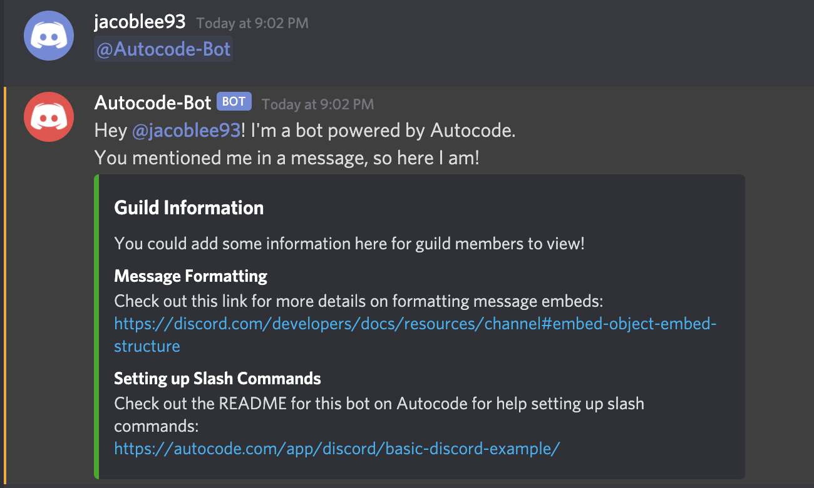
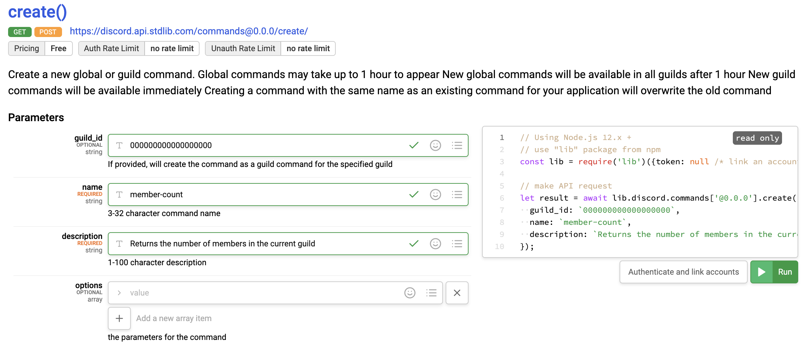
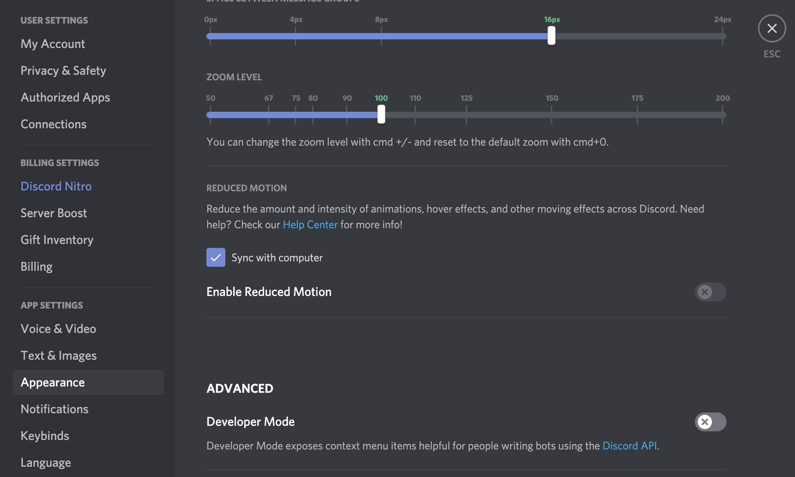
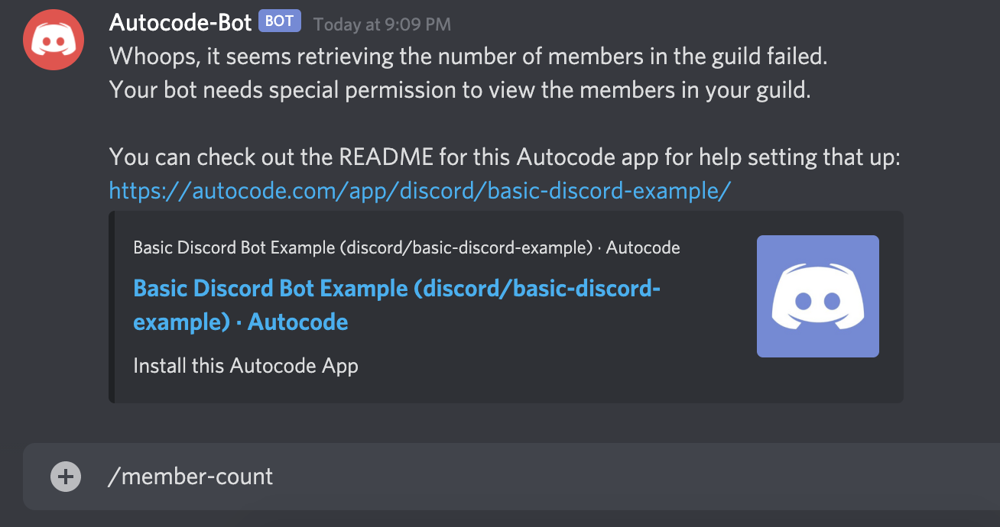
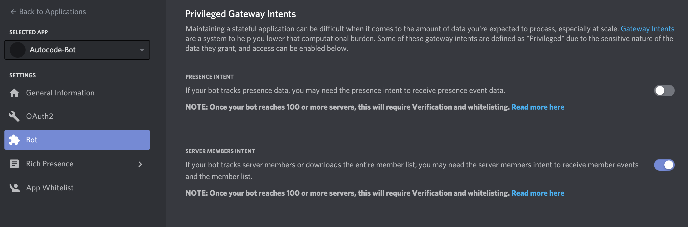
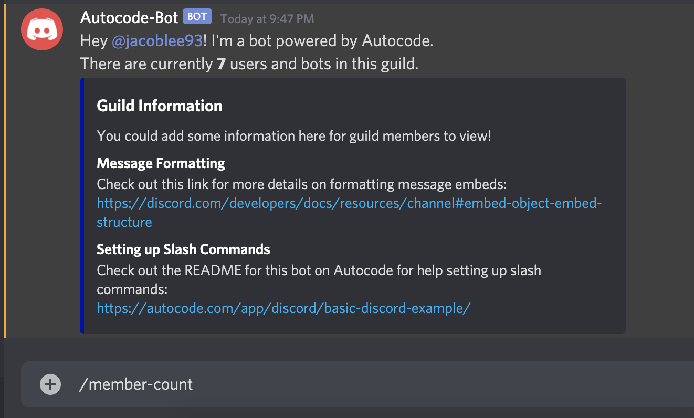

# Basic Discord Bot Example

This is a fully customizable example Discord bot that you can add to your
Discord guild in just a few clicks. You don't need anything other than a Discord
account to get started! After forking and setting up this app, your bot will:

1. Respond when it is tagged in a channel with a friendly, informational message.
1. Respond to a [Discord slash command](https://discord.com/developers/docs/interactions/slash-commands) 
called `/member-count` with the number of members in the guild.

The slash command requires a bit more setup after forking, but don't worry,
we'll walk through everything here! All behavior is completely customizable by 
editing the app code.

## Bot Mention Handler

The bot mention handler is relatively straightforward. You can find it under 
`functions/events/discord/bot_mention.js`. After creating and naming your bot and linking
it to Autocode, you can tag it as shown below to see a message like the one below:

## Member Count Command

[Discord slash commands](https://discord.com/developers/docs/interactions/slash-commands) 
are currently in open beta and can currently only be managed via API, which means
they require a bit more setup than the previous bot mention handler. Additionally,
Discord treats guild member related events and APIs as privileged, which means for
this specific command to work, you'll need to grant those privileges to your bot.

### Registering a Slash Command

After following the instructions to link your newly created Discord bot and
forking this app, you'll need to register the slash command via an API request.
Fortunately, you can easily do this by navigating to 
[the create method on the discord/commands API docs page in Autocode](https://autocode.com/lib/discord/commands/#create)
and taking advantage of the fact that you can make API calls from there.
After following the above link, set up the arguments to the API call like this:

For this bot, the `name` parameter must be `member-count`. We suggest creating the
command as a [guild command](https://discord.com/developers/docs/interactions/slash-commands#what-is-a-slash-command)
rather than a global one for this bot as global commands can take up to an hour
before they are visible, so you should also populate the `guild_id` parameter
with the id of the guild you added your bot to during the Autocode linking
flow.

If you don't have your guild id handy, you can retrieve it by enabling
`Developer Mode` in your Discord user settings under the `Advanced` section of
the `Appearance` tab:

After enabling developer mode, right click your guild icon in the left sidebar of
the interface and select `Copy ID` from the bottom of the menu, then paste it into
the `guild_id` input.

Finally, press `Authenticate and Link Accounts`, link the same bot you linked 
when forking this app, then press `Run` to finish registering your command with Discord!

### Granting Permissions

The final step to get this command working is to enable `Privileged Gateway Intents` 
for your bot. If you try to run your command before doing so, you'll see a message
like this:

To fix this, go to the 
[Discord developer portal](https://discord.com/developers/applications) and select
your bot out of the list to open your bot's settings. Press the `Bot` tab, then
scroll down until you see a section like the one below:

Enable the `Server Members Intent` using the toggle &mdash; don't forget to press
`Save Changes` afterwards! Then, try running your command again and you
should something like this:

This will also enable you to receive `guild.member` events for your bot, though
to get this working immediately you will need to update your bot's link to 
Autocode by re-linking it as a new linked resource (pressing `Link New Resource` and 
pasting its information into the setup guide again).

## Useful Links

- [Formatting Discord messages](https://discord.com/developers/docs/reference#message-formatting)
- [Discord slash commands](https://discord.com/developers/docs/interactions/slash-commands)
- [Discord developer portal](https://discord.com/developers/applications)
- [Autocode discord/commands API page for creating slash commands](https://autocode.com/lib/discord/commands/)
- [How to find your Discord guild id](https://support.discord.com/hc/en-us/articles/206346498-Where-can-I-find-my-User-Server-Message-ID-)

## Thank You!

If you have any questions or feedback, please join our community Slack channel 
from the **Community** tab in the top bar. You can also follow us on Twitter, [@AutocodeHQ](https://twitter.com/@AutocodeHQ).
